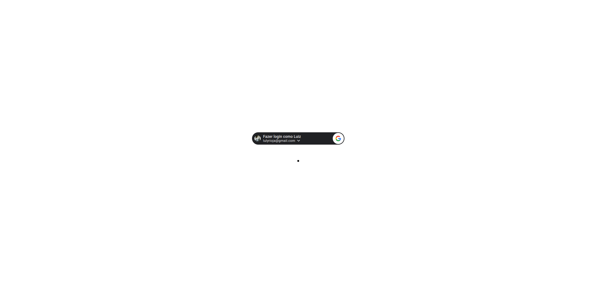
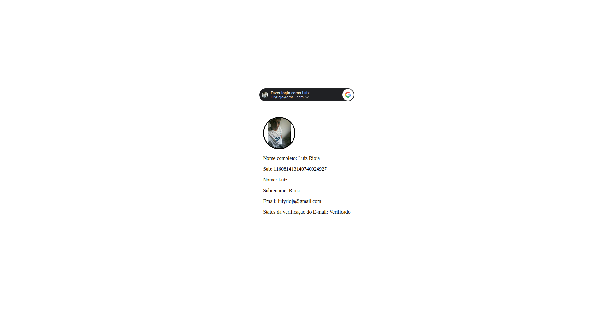
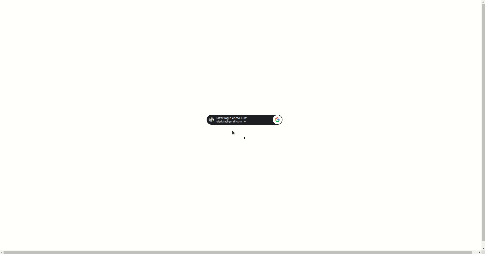

# Sign-in Social 👱

<p align="center">
  
  
  
  
</p>

<p align="center">
  <a href="#sobre">Sobre</a> •
  <a href="#sign-in-social">Sign-in Social</a> •
  <a href="#instalação">Instalação</a> •
  <a href="#tecnologias">Tecnologias</a> •
  <a href="#autor">Autor</a>  
</p>

## Sobre

Projeto criado com o objetivo de entender como criar login com conta Google.

## Sign-in Social

Esse projeto tem como finalidade entender na prática como integrar a autenticação com conta Google em um projeto.

A página criada é bem simples pois o objetivo é entender como integrar a autenticação Google em uma página e quais são os dados retornados.

Ao acessar a página, nos deparamos com o conteúdo abaixo:



Como visto acima, nada além do botão de login com a conta Google, que quando clicado irá trazer os email possíveis para login e após a escolha os dados serão exibidos na tela, como veremos a seguir:



Obviamente o projeto está longe de boas práticas e de uso real pois não era o objetivo. Deixo abaixo um GIF onde faço o fluxo completo do que seria o básico da autenticação social:



## Instalação

Antes de começar, você vai precisar ter instalado em sua máquina as seguintes ferramentas:
[Git](https://git-scm.com) e algum navegador moderno de sua preferencia. Além disso é bom ter um editor para trabalhar com o código como [VSCode](https://code.visualstudio.com/).

### 🖥️ Rodando o Front End (Web)

```bash
# Clone este repositório
$ git clone git@github.com:MrRioja/sign-in-social.git

# Acesse a pasta do projeto no terminal/cmd
$ cd sign-in-social

# Feito isso, basta abrir o arquivo index.html em um navegador de sua preferencia
```

## Tecnologias


<br><br><br>

## Autor

<div align="center">

<h1>Luiz Rioja</h1>
<strong>Backend Developer</strong>
<br/>
<br/>

<a href="https://linkedin.com/in/luizrioja" target="_blank">

</a>

<a href="https://github.com/mrrioja" target="_blank">

</a>

<a href="mailto:lulyrioja@gmail.com?subject=Fala%20Dev" target="_blank">

</a>

<a href="https://api.whatsapp.com/send?phone=5511933572652" target="_blank">

</a>

<a href="https://join.skype.com/invite/tvBbOq03j5Uu" target="_blank">

</a>

<br/>
<br/>
</div>
